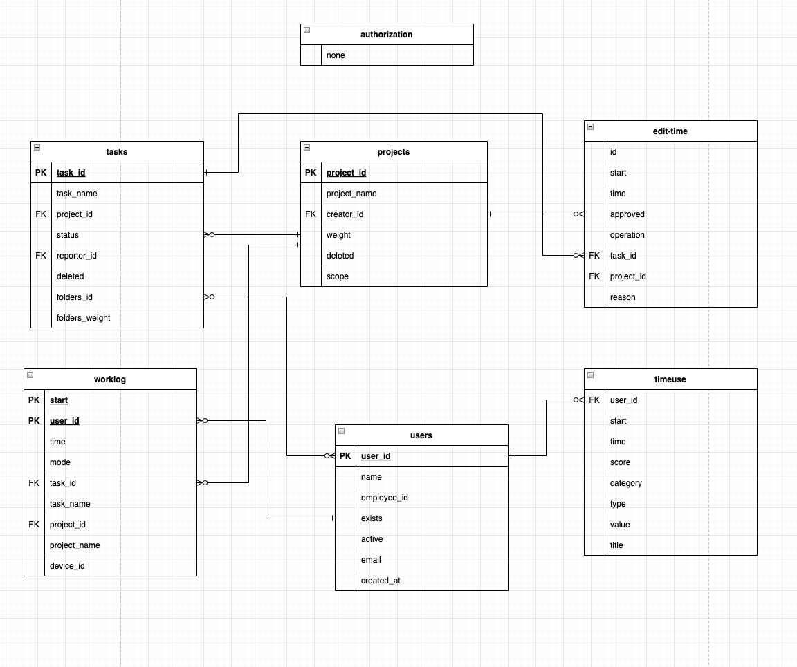

# Time Doctor 2 Extractor

There are two configs available for this extractor. One is for initial load and the second one is for increments.

It is recommended by TimeDoctor 2 API Docs to not use time window of more than 7 days.

# Configuration

User has to define an account to login with. This is a combination of email and password.
This account is used to retrieve token which is used as a parameter in all API calls.

- `email` (string):
parameters.api.authentication.loginRequest.params.email
- `password` (string - secured):
parameters.config.#password
- `datetime-from` (optional, string - ISO datetime format):
parameters.config.datetime-from - example: `2022-07-01T00:00:00.000Z`
- `datetime-to` (optional, string - ISO datetime format):
parameters.config.datetime-from - example: `2022-07-01T00:00:00.000Z`

## Table output

## Extractor Logic

1. Get auth token from /login endpoint

1. Get company ID from /authorization endpoint

3. Get list of users from /users endpoint

4. Use the list of users to iterate over /activity/worklog, activity/edit-time and /activity/timeuse endpoints. Both of these require specification of date range using “from” and/or “to” params in ISO datetime format.  

5. Consume data from /projects and /tasks endpoints.
 