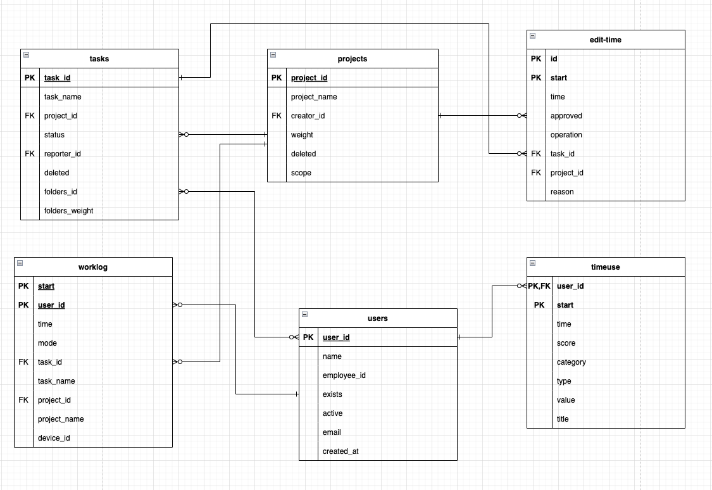

# Time Doctor 2 Extractor

It is recommended by TimeDoctor 2 API Docs to not use time window of more than 7 days.

**Initial load only supports backfill of up to 7 days. If the set time range is higher than that, it is not guaranteed that all records will be downloaded.**
If you need to do a historical sync (for example you want to fetch data for a whole year) you can contact Keboola support or use the **Template for full sync** below.

# Configuration

User has to define an account to login with. This is a combination of email and password.
This account is used to retrieve token which is used as a parameter in all API calls.

- `email` (string): Time Doctor 2 account to log in with
- `password` (string - secured): Time Doctor 2 password
- `paramFrom` (optional, string) - [strtotime](https://www.php.net/manual/en/function.strtotime.php) format:
 example: `7 days ago`


## Table output




## Extractor Logic

1. Get auth token from /login endpoint

1. Get company ID from /authorization endpoint

3. Get list of users from /users endpoint

4. Use the list of users to iterate over /activity/worklog, activity/edit-time and /activity/timeuse endpoints. Both of these require specification of date range using “from” and/or “to” params in ISO datetime format.  

5. Consume data from /projects and /tasks endpoints.

## Generic Extractor template for full sync

The only way to do a historical sync using generic extractor is using iterations.

Make sure to set following parameters:

1. parameters.api.authentication.loginRequest.params.email
2. parameters.config.#password
3. parameters.iterations[]
4. parameters.config.outputBucket

```
{
  "parameters": {
   "api": {
    "baseUrl": "https://api2.timedoctor.com/",
    "authentication": {
     "type": "login",
     "loginRequest": {
      "endpoint": "/api/1.0/login",
      "method": "POST",
      "params": {
       "email": "some@email.com",
       "password": {
        "attr": "#password"
       },
       "permission": "read"
      },
      "headers": {
       "accept": "application/json"
      }
     },
     "format": "json",
     "apiRequest": {
      "query": {
       "token": "data.token"
      }
     },
     "expires": {
      "response": "data.expiresAt"
     }
    },
    "pagination": {
     "method": "pagenum",
     "limit": 200,
     "firstPage": 0
    }
   },
   "config": {
    "name": "Time Doctor 2 Template",
    "Description": "Downloads users, projects, tasks, worklogs, notifications and user related info.",
    "debug": false,
    "outputBucket": "some-bucket-name",
    "#password": "some_password",
    "jobs": [
     {
      "endpoint": "/api/1.0/authorization",
      "dataField": "data.companies",
      "dataType": "authorization",
      "children": [
       {
        "endpoint": "/api/1.0/users?company={companyid}",
        "dataField": "data",
        "dataType": "users",
        "placeholders": {
         "companyid": "id"
        },
        "children": [
         {
          "endpoint": "/api/1.0/activity/worklog?company={2:companyid}&user={1:userid}",
          "dataField": "data.0",
          "dataType": "worklog",
          "placeholders": {
           "2:companyid": "id",
           "1:userid": "id"
          },
          "params": {
           "detail": "true",
           "task-project-names": "true",
           "from": {
            "attr": "datetime-from"
           },
           "to": {
            "attr": "datetime-to"
           }
          }
         },
         {
          "endpoint": "/api/1.0/activity/timeuse?company={2:companyid}&user={1:userid}",
          "dataField": "data.0",
          "dataType": "timeuse",
          "placeholders": {
           "2:companyid": "id",
           "1:userid": "id"
          },
          "params": {
           "from": {
            "attr": "datetime-from"
           },
           "to": {
            "attr": "datetime-to"
           }
          }
         },
         {
          "endpoint": "/api/1.0/activity/edit-time?company={2:companyid}&user={1:userid}",
          "dataField": "data.0",
          "dataType": "edit-time",
          "placeholders": {
           "2:companyid": "id",
           "1:userid": "id"
          },
          "params": {
           "from": {
            "attr": "datetime-from"
           },
           "to": {
            "attr": "datetime-to"
           }
          }
         }
        ]
       },
       {
        "endpoint": "/api/1.0/projects?company={companyid}",
        "dataField": "data",
        "dataType": "projects",
        "placeholders": {
         "companyid": "id"
        },
        "params": {
         "all": "true"
        }
       },
       {
        "endpoint": "/api/1.0/tasks?company={companyid}",
        "dataField": "data",
        "dataType": "tasks",
        "placeholders": {
         "companyid": "id"
        }
       }
      ]
     }
    ],
    "mappings": {
     "authorization": {
      "none": "none"
     },
     "users": {
      "id": {
       "mapping": {
        "destination": "user_id",
        "primaryKey": true
       }
      },
      "name": "name",
      "employeeId": "employee_id",
      "exists": "exists",
      "active": "active",
      "email": "email",
      "createdAt": "created_at"
     },
     "projects": {
      "id": {
       "mapping": {
        "destination": "project_id",
        "primaryKey": true
       }
      },
      "name": "project_name",
      "creatorId": "creator_id",
      "weight": "weight",
      "deleted": "deleted",
      "scope": "scope"
     },
     "tasks": {
      "id": {
       "mapping": {
        "destination": "task_id",
        "primaryKey": true
       }
      },
      "name": "task_name",
      "project.id": "project_id",
      "status": "status",
      "reporterId": "reporter_id",
      "deleted": "deleted",
      "folders.id": "folders_id",
      "folders.weight": "folders_weight"
     },
     "worklog": {
      "userId": {
        "mapping": {
         "destination": "userId",
         "primaryKey": true
        }
       },
       "start": {
        "mapping": {
         "destination": "start",
         "primaryKey": true
        }
       },
      "time": "time",
      "mode": "mode",
      "taskId": "task_id",
      "taskName": "task_name",
      "projectId": "project_id",
      "projectName": "project_name",
      "deviceId": "device_id"
     },
     "timeuse": {
      "parent_id": {
       "type": "user",
       "mapping": {
        "destination": "user_id",
        "primaryKey": true
       }
      },
      "start": {
        "mapping": {
         "destination": "start",
         "primaryKey": true
        }
       },
      "time": "time",
      "score": "score",
      "category": "category",
      "type": "type",
      "value": "value",
      "title": "title"
     },
     "edit-time": {
      "id": {
        "mapping": {
         "destination": "id",
         "primaryKey": true
        }
       },
       "start": {
        "mapping": {
         "destination": "start",
         "primaryKey": true
        }
       },
      "time": "time",
      "approved": "approved",
      "operation": "operation",
      "taskId": "task_id",
      "projectId": "project_id",
      "reason": "reason"
     }
    }
   },
   "iterations": [
    {
     "datetime-from": "2022-09-01T00:00:00.000Z",
     "datetime-to": "2022-09-07T23:59:59.999Z",
     "incrementalOutput": false
    },
    {
     "datetime-from": "2022-09-08T00:00:00.000Z",
     "datetime-to": "2022-09-15T23:59:59.999Z",
     "incrementalOutput": true
    },
    {
      "datetime-from": "2022-09-16T00:00:00.000Z",
      "datetime-to": "2022-09-18T23:59:59.999Z",
      "incrementalOutput": true
     }
   ]
  }
 }
```
 